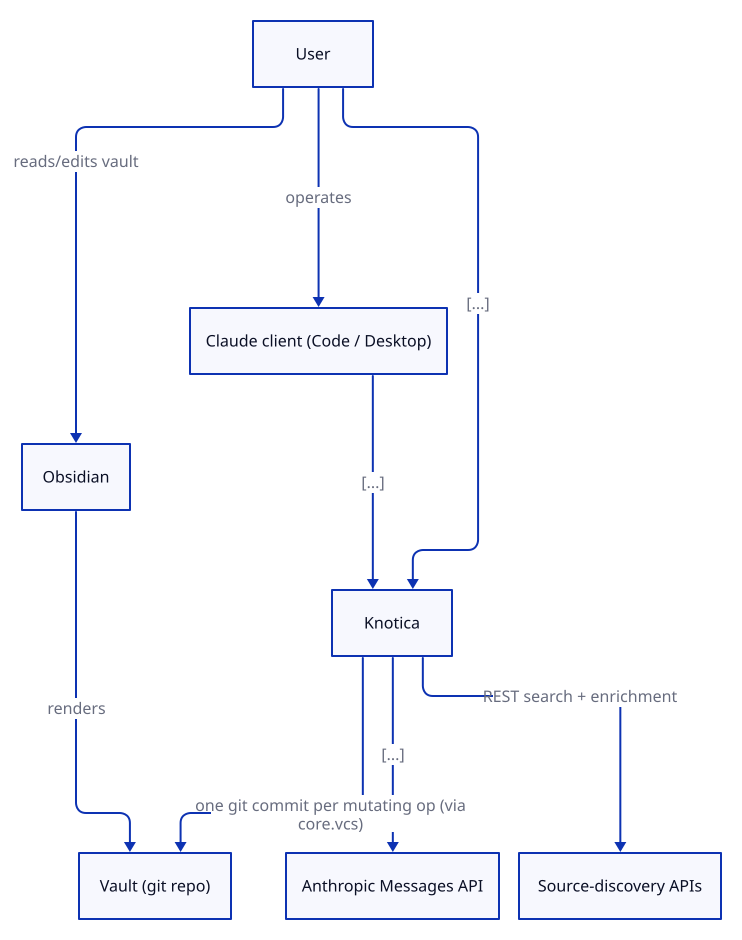
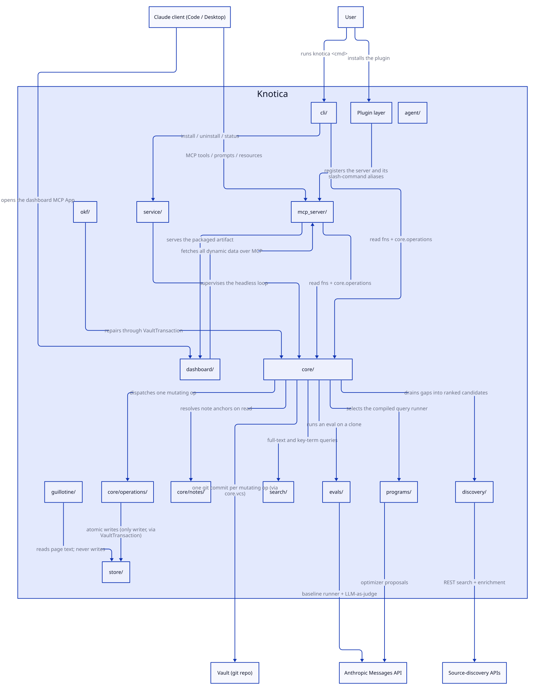

# Architecture

<!-- Design-target architecture document. Abstracts above concrete code to define the space of valid
     implementations; carries rationale, Status markers, and Planned components. The code-verified
     developer navigation guide is docs/architecture.md. This document is the design canon; the
     superseded original pre-plan is archived at .ai-state/design-history/PRE_PLAN.md.
     Created by systems-architect, updated by implementer, validated by verifier/sentinel.
     Section ownership: skills/software-planning/references/architecture-documentation.md. -->

## 1. Overview

| Attribute | Value |
|-----------|-------|
| **System** | Knotica — an AI-maintained, compounding knowledge wiki |
| **Type** | Stateless MCP server + CLI over a versioned Obsidian vault; Claude plugin |
| **Language / Framework** | Python 3.12+ (uv) / official `mcp` SDK 1.28.1 (`FastMCP`) |
| **Architecture pattern** | Hexagonal, single-mutation-core (one writer through a `VaultTransaction`) |
| **Source stage** | Pipeline `arch-doc-cleanup` — full reconciliation against the codebase |
| **Last verified** | 2026-08-05 by systems-architect |

Knotica implements Karpathy's llm-wiki pattern: an AI-maintained compounding markdown knowledge base
in an Obsidian vault, with per-topic self-improving loops (DSPy inner, SIA outer). The **client's LLM
is the brain** for interactive work; the server exposes deterministic tools and is **stateless** — the
vault (a git repo) and `~/.config/knotica/config.toml` are the only durable state, resolved per call.
(The loop daemon's gitignored `.knotica/locks/` runtime markers are neither session nor durable state —
scoped once in [§ 7 Constraints](#7-constraints), `dec-074`.)

The load-bearing structural property is that **every vault mutation flows through one code path** — a
`VaultTransaction` in `core` that flock-guards the operation, buffers and secret-scrubs writes, applies
them atomically, appends the log, and makes exactly one git commit — so MCP tools, the CLI, and the
headless loops cannot drift into inconsistent discipline.

## 2. System Context

<!-- L0: system boundary + external actors. Source: docs/diagrams/architecture/src/architecture.c4 -->

*Source: [`docs/diagrams/architecture/src/architecture.c4`](../docs/diagrams/architecture/src/architecture.c4),
the source of truth for § 3a — one `component` element there is one § 3a row here. `scripts/diagram_regen.sh`
re-renders every view from it and is wired into pre-commit on any `.c4` change.*

External actors and dependencies:

- **User** — operates a Claude client and reads/edits the vault directly in Obsidian.
- **Claude client (Code / Desktop)** — client-as-brain; performs ingest/query/lint guided by vault schemas.
- **Obsidian** — frontend over plain markdown + wikilinks + frontmatter (no plugin).
- **Vault (git repo)** — the wiki itself, a separate private repo at a user-configured path. Several
  named vaults may be configured; one is active at a time and switchable at runtime.
- **Anthropic Messages API** — headless-only LLM access (eval, compile, `query`), never resolved on the
  lean MCP launch path (`dec-014`).
- **Source-discovery APIs** — you.com search + OpenAlex enrichment, reached only from `discovery/`.
- **`uv`/`uvx`** — hard prerequisite; launches the server from the plugin checkout.

Deployment is out of scope (Phases 0–4 are local-only; no `SYSTEM_DEPLOYMENT.md`).

## 3. Components

<!-- aac:generated source=docs/diagrams/architecture/src/architecture.c4 view=components last-regen=2026-08-05 -->

### 3a. Structural components

One row per `component` element in the LikeC4 model, sixteen in all. Thirteen are packages under
`src/knotica/`. The dashboard is one component spanning the repo-root Preact client and the
`src/knotica/dashboard/` package that loads it (`dec-070`). The plugin layer is a repo-root surface with
no Python package, and `agent/` is Planned with no code on disk — so those two, and the dashboard's
repo-root half, have no row in the inventory below. Rows are deliberately terse: the
cross-cutting behaviour they compose is § 3b, and the invariants they must uphold are § 7. Module counts
are **not** repeated here — they live once in the inventory table below (`dec-073`). The two-tier split,
and the `TEST_TOPOLOGY.md` rule change it forced, are `dec-075`.

| Component | Responsibility | Status |
|---|---|---|
| `src/knotica/store/` | `VaultStore` protocol + `LocalFSStore`: atomic temp+rename primitives and the path-escape boundary (`PathOutsideVaultError`). No git, log, or schema knowledge | Built |
| `src/knotica/search/` | `SearchBackend` protocol + `RipgrepBackend` (live Okapi BM25, no index — `dec-052`), `cursor.py` (the opaque pagination token), `retrieval.py` (headless key-term retrieval shared by both answer paths) | Built |
| `src/knotica/core/` | Vault semantics and the sole mutation path. **Read this row as a subtraction:** `core/operations/` and `core/notes/` carve packages out of it, and four § 3b capabilities — the write path, the loop lifecycle, query compile, and the gap-fill spine — carve clusters out of it; what remains is `transaction`/`lock`/`vcs`/`scrub`, the vault vocabulary (`config`, `config_write`, `schema`, `page`, `links`, `lint`, `records`, `errors`, `template`, `vault_layout`, `topics`, `jsonl`), and the shared read/aggregate substrate every surface renders from (`status`, `doctor`, `metrics`, `prompts`, `datasets_inventory`, `golden_review`, `index_catalog`, `vault_metadata_tree`, `vault_scaffold`, `ingest_activity`, `text_reflow`, `baseline_probe`), and `process_model` — the single declaration of the six process lanes and their stage rails, which every lane surface (the MCP lane dispatchers, the served `wiki_status` payload, the generated TypeScript mirror, `knotica lane`) projects rather than restates, in the same one-declaration spirit as `branch_namespaces` | Built |
| `src/knotica/core/operations/` | Mostly one module per mutating operation, though `guillotine.py` exports two and `reanchor_note.py` three. Nine modules open a `VaultTransaction`, each opening exactly one; `doctor_repair.py` and `promote_note.py` open none — the latter delegates to `curate_example` or `gapfill.report_gap`, which carry their own. `__init__.py` re-exports a subset (`write_page`, `store_source`, `create_topic`, `curate_example`, `migrate`, `doctor_repair`, `apply_guillotine`, `persist_guillotine_artifacts`) while the notes operations and `reflow_sources` are imported by path. `candidate_scope.py` is a routing helper, not an operation | Built |
| `src/knotica/core/notes/` | Personal-notes overlay model: `anchor` (document + append-only anchor history), `resolve` (the read-time resolution ladder, rungs 0–10), `candidates` + `scoring` (fuzzy candidate generation and the Hypothesis-weighted scorer), `supersession` (page-replaced vs passage-reworded), `reconcile` (post-merge drift-queue notification), `store` (read-only enumeration). `dec-058`, `dec-061` | Built |
| `src/knotica/mcp_server/` | FastMCP adapter: 25 flat conversational tools, 9 operator dispatchers, `open_dashboard`, 4 resources + 1 UI resource, 4 prompts. `vault_ctx.with_resolved_vault` is the per-call config-resolution and error-mapping seam every tool routes through — the concrete form of the stateless-server invariant. Named `mcp_server` to avoid shadowing the `mcp` SDK (`dec-009`) | Built |
| `src/knotica/cli/` | `knotica` console entry point. `cli/__init__.py::COMMAND_NAMES` is the single declaration of the subcommand set; one module per command plus `common.py` (Console, exit codes, stdout=data / stderr=messages) | Built |
| `src/knotica/evals/` | Frozen-corpus evaluator: clones the vault at a pinned SHA, scores a held-out golden set through `dspy.Evaluate` over a baseline runner and a cached LLM-as-judge, composes one stable scalar, and appends a `MetricsRecord` **on the clone**. `anthropic`/`dspy` are isolated in the `evals` extra and imported lazily | Built |
| `src/knotica/programs/` | The DSPy query program: MIPROv2 with a bootstrap fallback, recording `optimizer`/`fallback_reason` on the artifact, plus `CompiledRunner` | Built |
| `src/knotica/discovery/` | Outbound source discovery for gap-fill. Pure network boundary: no vault access, no LLM, no state. `normalize.py` is the identity leaf — the single declaration of when two candidates are the same source. `dec-026`, `dec-027` | Built |
| `src/knotica/okf/` | Native OKF conformance — one shared format model with three verbs over it: `check` (read-only findings), `export` (a bundle written outside the vault), `repair` (the only mutator, through `VaultTransaction`) | Built |
| `src/knotica/guillotine/` | Memory Guillotine — claim-level retraction, demotion, and evidence audit. A read-only pipeline: find mentions, classify passage roles, score a verdict, localize the contested passage, render a diff. It never rewrites page prose. `dec-033` | Built |
| `src/knotica/service/` | OS-service lifecycle for the loop watcher (+ 2 unit templates). One interface over launchd (live-verified) and systemd `--user` (code-complete, untested — `status().verified` reports which), plus the supervised daemon that iterates every configured topic in one process. `dec-044` | Built |
| Dashboard (`dashboard/` + `src/knotica/dashboard/`) | Single-file Preact MCP client: eight tab panes plus per-pane panels, built to one self-contained HTML artifact; all dynamic data arrives over MCP. `src/knotica/dashboard/` is its packaging seam — a small loader resolving the wheel-packaged `app.html`, falling back to `dashboard/dist/index.html` in a checkout, so an installed user needs no Node toolchain. Modelled as one component rather than two: the loader's whole purpose is to serve the client to both mounts (`dec-070`). `dec-020` | Built |
| Plugin layer (repo root) | `.claude-plugin/plugin.json`, `.mcp.json`, one `/knotica:*` alias per file under `commands/`, `hooks/` (non-blocking SessionStart pre-warm + nudges), `skills/wiki-maintenance/`. Distribution runs through the external `bit-agora` marketplace | Built |
| `src/knotica/agent/` | SIA outer-loop runners: generations mutate overlays/prompts/structure, keep/discard on eval score, winning diffs land as vault-repo PRs (Phase 3b) | Planned |

### 3b. Capabilities

Cross-cutting features composed from the components above. Each owns no single directory, which is why
none of them is a § 3a row.

| Capability | Responsibility | Composed from | Status |
|---|---|---|---|
| **Single-mutation vault write path** | flock → buffer + secret-scrub at declaration → atomic per-path write → append `log.md` → one path-scoped git commit. A no-op transaction makes **zero** commits. `work_dir=` redirects commit/rollback to a git worktree while still taking the flock against the canonical root — the mechanism behind source-ingest candidates. `dec-008`, `dec-046` | `store/`, `core/`, `core/operations/` | Built |
| **Autonomous loop lifecycle** | observe → gate → heal, per topic, on a clone. Baseline policy, instrument re-freeze, four observation guards, candidate gating, arena prompt-healing. A race carries its scorer's provenance and **aborts** rather than reverts when that scorer cannot be ranked against the gate baseline; `[loop] arena_scorer` chooses between the free keyword heuristic (default, never gate-comparable) and the billed eval-backed scorer. `dec-043`, `dec-048`, `dec-068`, `dec-072` | `core/`, `evals/`, `cli/`, `service/` | Built |
| **MCP tool surface** | Two-tier topology: 25 flat conversational tools carry the high-density verbs; 9 action-parameterized dispatchers route the operator long tail. `dec-041`, `dec-045`, `dec-050` | `mcp_server/` | Built |
| **Query compile & promote** | Curated trainset → MIPROv2 compile on a clone → `compile/*` branch → human review → promote. `query_engine` is the one answer path shared by the MCP `query` tool, the dashboard Ask pane, and the arena. `dec-021`, `dec-022`, `dec-049` | `programs/`, `core/`, `mcp_server/`, Dashboard | Built |
| **Gap-fill spine** | P1 diagnose (fault classifier) → P2 discover (ranked candidates) → P3 approve (suggestion queue) → P4 gated ingest (candidate branch, merge or quarantine). A refusal is re-workable in both directions: re-opening the ingest resumes from the quarantine ref, and the stamped verdict is replayed only while the inputs it was computed from (candidate tree, golden manifest, baseline, harness) are unchanged. `dec-024`, `dec-025`, `dec-029`, `dec-030`, `dec-036`, `dec-037`, `dec-038` | `core/`, `discovery/`, `mcp_server/`, `cli/`, `evals/` | Built |
| **Notes overlay** | capture → resolve → recall → correct → promote. Personal marginalia outside the scored corpus, anchored to KB prose by quote + commit, re-resolved on every read. `dec-056`, `dec-057`, `dec-058`, `dec-060`, `dec-061`, `dec-066` | `core/notes/`, `core/operations/`, `mcp_server/`, Dashboard, Plugin layer | Built |

### Package inventory (gate-checked)

Every package under `src/knotica/` with its module count, `__init__.py` included. This is the **single
site** for those counts — a count published twice is a count that drifts once, so no row above restates
one (`dec-073`). `scripts/check_architecture_coverage.py` runs on every `make verify` and fails when a
package's count drifts from the tree, when a package has no row here, when a row names a package that
does not exist, or when any `src/knotica/...` path cited in either architecture document stops
resolving on disk.

The table is a superset of § 3a: `src/knotica/` itself is a package (one `__init__.py`) and needs a row
for the gate, but it is not a component and owns no responsibility. The gate proves every module is
*accounted for*, never that it is *described* — that remains a matter for review.

| Package | Modules |
|---|---|
| `src/knotica/` | 1 |
| `src/knotica/cli/` | 17 |
| `src/knotica/core/` | 63 |
| `src/knotica/core/notes/` | 8 |
| `src/knotica/core/operations/` | 13 |
| `src/knotica/dashboard/` | 1 |
| `src/knotica/discovery/` | 10 |
| `src/knotica/evals/` | 16 |
| `src/knotica/guillotine/` | 9 |
| `src/knotica/mcp_server/` | 40 |
| `src/knotica/okf/` | 11 |
| `src/knotica/programs/` | 2 |
| `src/knotica/search/` | 4 |
| `src/knotica/service/` | 3 |
| `src/knotica/store/` | 2 |

<!-- aac:end -->

### 3c. Two `core/` leaves worth the words

Kept outside the generated fence above deliberately: this is authored narrative, and a `likec4 gen` over
that region would erase it. Both leaves exist because a consolidated declaration beats a correct copy,
and both have already been re-derived by hand once:

- **`topics.py`** — topic *identity* against the store: `is_topic`, `require_topic`, and the one vault-root
  walk every "which topics are there?" caller shares. A wrapper around a consolidated predicate is still a
  copy of the policy, which is how three modules ended up holding their own topic walk and one of them
  drifted onto an inline re-implementation (td-040). Its pure, store-free counterpart for *path*
  classification is `vault_layout.py`.
- **`jsonl.py`** — lenient JSONL reading for the append-only logs whose value is the rows that *do* parse,
  so a truncated final line from a crashed append cannot take down a whole-file read. Callers needing
  strict parsing raise their own typed error and deliberately abstain.

### 3d. Layer positions and the dependency rule

**Dependency rule (fitness-checked):** arrows point inward toward `store/`. The *only* writer of the
vault is `core.transaction`. `tests/test_architecture_boundaries.py` enforces this across three distinct
scopes — see § 7, which states each invariant next to the check that holds it.

| Layer | Position | Vault mutation |
|---|---|---|
| `okf/` | Domain layer over `core`; adapters are `cli/okf.py` + the `vault_health` dispatcher | **Yes**, only through `core.transaction` (`repair.py`). The one non-adapter member of `RAW_WRITE_PACKAGES` |
| `guillotine/` | Pure read-only analysis; its transaction-bearing adapter is `core/operations/guillotine.py` | **No** |
| `service/` | OS-lifecycle layer *beside* the spine; imports the loop lazily | **No**. Writes an OS unit file and a log directory; shells out to `launchctl`/`systemctl`, never git |
| `discovery/` | Pure outbound-network boundary; inward edges are `core.errors` and, in `config.py` alone, `core.config` | **No** |
| `dashboard/` | Leaf artifact + loader; the `mcp_server` mounts depend on it, never the reverse | **No** |

The one cross-domain edge among them is `guillotine.report → okf.frontmatter`, one-directional and
acyclic. Two `mcp_server` modules carry an `mcp_server → evals` edge at import time: `tools_dispatch_vault.py`
(`evals.llm` credential-name constants) and `tools_datasets.py` (`evals.config.WORKER_SNAPSHOT` and two
`evals.golden` error types). Both stay off the heavy tree: importing the server loads most of `evals/`, but no `anthropic`, `dspy`,
or `litellm` — every one of those is behind a lazy import, which is what keeps the extra off the launch
path.

## 4. Interfaces

### MCP tool surface

**35 tools**: 25 flat conversational tools, 9 operator dispatchers, and `open_dashboard`. Every tool
resolves config per call through `mcp_server/vault_ctx.py` and returns a structured envelope, never a
transport exception (`dec-001`). Mutating dispatcher actions accept `mode=dry-run|apply`.

| Dispatcher | Actions |
|---|---|
| `loop` | `run_once` \| `run_eval` \| `set_baseline` \| `baseline_policy` \| `rebaseline` \| `cadence` |
| `branches` | `scoreboard` \| `promote_loop` \| `promote` \| `delete` |
| `compile` | `run` \| `status` \| `promote` |
| `datasets` | `inventory` \| `records` \| `bootstrap` \| `bootstrap_train` \| `freeze` |
| `arena` | `status` \| `history` |
| `golden` | `load` \| `save` |
| `notes` | `list` \| `read` \| `drift` \| `reanchor` \| `detach` \| `promote` \| `archive` |
| `vault` | `list` \| `status` \| `use` \| `add` \| `create` |
| `vault_health` | `doctor` \| `repair` \| `okf_check` \| `okf_repair` \| `lint` \| `metadata_tree` |

The 25 flat tools, by module: `tools_read.py` — `list_topics`, `read_page`, `search`, `list_links`,
`lint_check`; `tools_write.py` — `write_page`, `store_source`, `create_topic`, `curate_example`;
`tools_status.py` — `wiki_status`, `metrics_read`, `baseline_probe`; `tools_suggestions.py` —
`suggestions_read`, `suggestions_review`; `tools_gaps.py` — `gap_report`, `gaps_read`,
`gapfill_discover`; `tools_source_ingest.py` —
`source_ingest_open`, `source_ingest_submit`; `tools_ingest.py` — `ingest_progress`,
`ingest_activity_read`; `tools_query.py` — `query`; `tools_notes.py` — `note_capture`;
`tools_prompt_diff.py` — `prompt_diff`; `tools_guide.py` — `read_protocol`.

Also registered: 4 resources (`knotica://schema/root`, `knotica://schema/topic/{topic}`,
`knotica://schema/resolved/{topic}`, `knotica://index`) plus the `ui://knotica/dashboard` MCP-App
resource, and 4 prompts (`ingest`, `query`, `lint`, `curate`) with static names and lazily-resolved
bodies (`dec-010`).

**Error grammar.** `core/errors.py` holds the shared `ErrorCode` enum, `RETRYABLE_CODES`, and the
envelope constructors every surface returns through. `INVALID_ARGUMENT` signals argument-validation
failure (bad `action`, `mode`, enum, or range) and is distinct from `INVALID_CURSOR` (`dec-040`).
Every dispatcher validates its action against its own `_ACTIONS` tuple before doing any work.

**Dispatch telemetry.** `mcp_server/dispatch_telemetry.py` is the sink; `mcp_server/recording_server.py`
is the single thing that feeds its `dispatch` signal. `RecordingServer` subclasses `FastMCP` and
overrides `call_tool` — the one method every tool call passes through, flat and dispatcher alike — so
**coverage is a property of the server, not a convention each tool module has to follow**: a newly
registered tool cannot be added without being measured. It records *after* the handler returns, so the
`outcome` is the terminal result rather than an optimistic default; the nine dispatcher call sites this
replaced recorded above their handler, where the result is not yet knowable, and so reported `ok`
whatever happened next. It must be a subclass and not a post-construction patch: `FastMCP.__init__`
binds `self.call_tool` into the low-level handler, so a later attribute assignment is never reached —
measured, and silent when wrong. `record_rejected_action` stays with the handlers that refuse an
unknown action, because it carries the valid set this layer cannot see; a refusal is a distinct
`rejected` event, so the dispatch count stays exactly one per invocation. Their
per-domain counts are the evidence `dec-045`'s falsifier depends on: if the model mis-selects within a
domain, the consolidation hurt and that dispatcher should revert to flat tools. Every signal also
appends a timestamped JSONL record carrying a five-value routing `outcome`, to an **opt-in** sink
named by `KNOTICA_TELEMETRY_DIR`. That sink is deliberately **outside every vault**: tool routing is a
property of the server's tool surface, not of any one wiki, so it must neither fragment across
configured vaults nor vanish while the server is unconfigured. The module stays a stdlib-only leaf by
resolving its own destination at write time rather than taking a root, and writes best-effort — a sink
failure is logged and swallowed, never raised.

**Billing gate.** `loop action=run_eval` and `loop action=run_once` are both two-phase: a bare call
returns a preview and a nonce; only a confirmed second call bills. `run_eval` additionally passes
`force=True`, bypassing the cadence hold; `run_once` does not (`dec-048`).

### Python seams

- `VaultVcs.clone_to(dest_root, ref=None) -> VaultVcs` — the frozen-corpus mechanism. A read/checkout
  method, never a mutation, so `evals/` may call it directly (`dec-017`).
- `LLMClient.complete(*, snapshot, system, messages, temperature=0.0, max_tokens, json_schema=None) -> Completion`
  — the one network seam (a Protocol). `AnthropicClient` resolves credentials OAuth-first
  (`CLAUDE_CODE_OAUTH_TOKEN` preferred; the metered `ANTHROPIC_API_KEY` is a noisy fallback) and records
  `auth_mode`; `FakeLLMClient` is the zero-network double (`dec-014`).
- `build_metric(...)` → `score(gold, prediction, trace=None) -> float | bool` — the triple-consumer
  seam: a bounded per-example quality float when `trace is None`, the bool `quality >= threshold` when
  set (`dspy.Evaluate`'s convention) (`dec-012`).
- `run_eval(topic, *, source_root=None, ref=None, llm_client=None, config=DEFAULT_CONFIG, cache=None, work_root=None, on_example=None, on_substage=None, on_outcome=None, **overrides) -> EvalRunResult`
  — clone → load golden → `dspy.Evaluate` → compose scalar → one `VaultTransaction` on the clone. The
  three callbacks are the progress seams the watcher wires to `core.loop_progress`; `on_outcome` fires
  once per example with `(id, status, error_class, detail)` (`dec-053`).
- `harness_version(judge_prompt_hash, config=DEFAULT_CONFIG) -> str` — the instrument fingerprint, so
  two scalars from different instruments are never silently compared. Folds the judge prompt hash, judge
  and worker snapshots, runner config hash, and scalar formula version. `num_threads` is deliberately
  **excluded**: parallelism changes wall-time, not the measurement.
- `LoopRunner.observe_default(*, auto_baseline=True, force=False) -> LoopCycleResult` — the observe leg;
  `poll_once() -> LoopCycleResult` — the gate leg, at most one pending candidate per call.
  `set_baseline_policy`, `rebaseline(mode)`, and `mark_observed()` change gate state without an eval.
- `write_heartbeat` / `read_runner_liveness` and `write_progress` / `read_progress` — plain filesystem
  pairs under `.knotica/locks/`. No `VaultStore`, no git, no commit.

### Diagnostic manifest (schema v2)

The per-run manifest at `<topic>/.knotica/eval-runs/gen-<N>/manifest.json` is the diagnostic substrate
the fault classifier reads. It self-versions via `manifest_schema_version` (today's value is 2; an
unversioned manifest is implicit v1, which the classifier refuses). Per golden example it carries a
stable `id` (the edit-stable `QARecord.id` join key) and `pages` (the ordered top-K retrieval trace),
and it populates `held_out_delta` with a scalar delta plus per-`id` score and trace diffs against the
prior generation, `null`-never-`0` when no comparable prior exists. Retrieval *scores* are excluded —
rank order only, so the contract survives a future vector-backend swap. The change touches no eval
scalar and no `harness_version` input, so it triggers no baseline re-freeze (`dec-023`).

## 5. Data Flow

**Mutating op.** `client → MCP tool / CLI → core.operations.<op> → resolve config (per call) →
VaultTransaction: flock → write() buffers and secret-scrubs at declaration → (block exit) diff against
disk, dropping unchanged writes → store.write_text_atomic per path → append log.md → vcs.commit_paths
(one path-scoped commit, subject `knotica(<op>): <topic> — <title>`) → release flock → Result`. A
transaction whose writes all match disk short-circuits: `changed=False`, **zero commits**. On any
exception the rollback restores exactly the touched paths. `core.transaction.vault_mutation_span` holds
the flock across a *sequence* of transactions when a caller needs several commits to be atomic against
other writers.

**Read op.** `client → tool → core read fn / search backend → Result`. No lock, no commit.

**Prompt.** `client slash-command → prompts/get → lazy body: resolve config → unconfigured?
setup-guidance : read `.knotica/prompts/<op>.md` (topic override else root default) → body`.

**Note capture.** `note_capture → capture_note → validate → plan the anchor (substring-match the quote
against the claimed pages, degrading to page or topic fidelity rather than guessing) → one
VaultTransaction → read the note back with anchors resolved → Result (a pre-composed `placement`
sentence + any `ANCHOR_DEGRADED` warning)`. Anchoring never fails the call.

**Note resolution** (every `notes` read and every capture readback). `for each anchor:
vcs.read_file_at(pinned_at, page) + store.read_text(page) → resolve_anchor → Projection {status,
fidelity, span, score}`. A pure function of two text blobs, recomputed on every read rather than
cached, so a resolver improvement applies retroactively to every existing note without touching a file.

**Eval op** (headless, no client-brain). `resolve config → VaultVcs.clone_to(tmp) at HEAD
(corpus_ref = git:<sha>) → load golden.jsonl → per example: baseline runner drives the clone's query.md
with in-process retrieval → cached N-median LLM-as-judge + deterministic citation integrity → hinged
budget-relative scalar → MetricsRecord → VaultTransaction(clone, "eval") → source vault untouched`.
Runs on a knotica-owned credential, env-only, never on the server launch path (`dec-014`).

**Unconfigured boot.** The server registers every tool, prompt, and resource with zero vault access;
the first call resolves config and returns `unconfigured` until `knotica init`, `knotica desktop`, or
`vault action=add|create` writes `config.toml`. Picked up per call — no restart (`dec-004`).

**Watch tick** (headless). `poll → observe_default: cursor moved? → content changed (ignores log.md,
non-prompts .knotica/ paths, and every family outside SCORED_FAMILIES)? → _observation_hold (active
ingest, quiet window) → retry_hold (attempt identity + failure backoff) → _cadence_hold (skipped when
force=True) → _ensure_union_log_merge → note_attempt → write LoopState (suppressed when the attempt
records nothing new) → pin eval_ref → clone → run_eval → fetch the metrics commit into loop/r/<sha> →
merge → prune merged result branches → baseline unset? auto-freeze : instrument changed? re-freeze :
policy=best and scalar>baseline? ratchet : compare → regressed? classify faults, then heal prompts via
the arena unless every regressed question is knowledge-cause → gate: poll_once → one pending loop/c/*
tip → evaluate on a clone → keep or discard`.

### Baseline transitions

`LoopState.baseline_policy` (`"latest"` default, or `"best"`) governs what an observation does to the
frozen baseline. Evaluated in `observe_default`:

| Condition | Action |
|---|---|
| No baseline yet, `auto_baseline=True` | Freeze the observed scalar (a fresh topic self-gates with zero setup) |
| Observation's `harness_version` differs from the baseline's | **Instrument re-freeze** — never a regression |
| `scalar > baseline`, policy `best` | Ratchet the baseline up (high-water mark) |
| `scalar >= baseline`, either policy | Hold; the decision passes |
| `scalar < baseline` | Regression — classify, then heal |

`latest` never ratchets on a win: only auto-freeze and instrument re-freeze move the baseline. A
baseline is only meaningful under the harness fingerprint that produced it, which is why a judge-prompt
edit, model rotation, or dspy upgrade re-freezes rather than comparing across instruments; the
loop-state commit message records both scalars for audit. `rebaseline(mode)` freezes from
`metrics.jsonl` with no eval, restricted to records matching the newest `harness_version`;
`mark_observed()` adopts HEAD as observed after a human reconciles an interrupted run.

### Branch topology

| Prefix | Meaning | Lifetime |
|---|---|---|
| `loop/c/*` | Pending candidates awaiting the gate — prompt candidates `loop/c/<sha>`, source candidates `loop/c/<topic>/source-<id8>` | Deleted on keep (fast-forward) or discard; a refused source is renamed to `loop/x/*` |
| `loop/wip/*` | In-flight source ingest on a server-managed worktree, invisible to the gate until published | Published to `loop/c/*` or abandoned |
| `loop/x/*` | Quarantined refused source candidates carrying a bounded per-question dilution diff | Kept, pruned to newest 5 per topic |
| `loop/r/*` | Merged observation-eval audit pointers | Already ancestors of the default branch; pruned beyond the newest 5 |
| `compile/*` | Pending compile proposals awaiting promotion | Deleted on promote or discard |

`core/branch_namespaces.py` is the single declaration of all five prefixes and the classify/parse
helpers. A source candidate is distinguished from a prompt candidate by branch name alone — no
persisted `candidate_kind` (`dec-036`). A source candidate that regresses is **quarantined, never raced
through the arena**: the arena heals prompt regressions, and racing a prompt against content dilution
risks a prompt that masks it (`dec-038`). Pruning is best-effort and never fails the operation that
triggered it; unmerged pointers are left as evidence of an interrupted run.

`log.md` is append-only, so concurrent branches legitimately append at the same location.
`_ensure_union_log_merge` self-heals a `log.md merge=union` rule into the vault's `.gitattributes`
before every merge; the eval clone is pinned *after* the loop's own state commit, so the live side only
reconciles concurrent human activity, which the union attribute absorbs.

## 6. Dependencies

| Slot | Declaration | Contents |
|---|---|---|
| Runtime | `[project] dependencies` | `mcp>=1.28` (resolves 1.28.1), `pydantic>=2.13.4` |
| Headless extra | `[project.optional-dependencies] evals` | `anthropic>=0.116`, `dspy>=3.2`, `litellm<1.92` |
| Dev | `[dependency-groups] dev` | `pytest`, `ruff`, `mypy`, `pyyaml` |

The eval dependencies are declared **only** in the extra, so the wheel `uvx --from … knotica mcp`
resolves never pulls dspy's heavy tree onto the launch path. The extra is the single declaration —
`[dependency-groups]` deliberately carries no `evals` entry, and `tests/test_packaging_evals_extra.py`
holds that shape (`dec-013` → `dec-055` → `dec-067`). The `litellm<1.92` bound is load-bearing on
macOS: litellm ships no macOS wheel from 1.92.0 and the sdist needs a Rust toolchain.

Build backend `hatchling` (src layout; repo-root `vault-template/` force-included into the wheel, with
an editable-install fallback to the repo copy). `git` and `uv`/`uvx` are user-machine prerequisites.
`ripgrep` is a **performance** dependency, not a prerequisite: `RipgrepBackend` falls back to a pure-Python
markdown walk when `rg` is absent, and both engines only choose which files might match — counting,
snippet extraction, and BM25 scoring run in one shared Python pass, so results are identical either way.

## 7. Constraints

Locked invariants. Each is stated with the mechanism that holds it — an invariant with no enforcement
is a wish. Do not violate without updating this section first.

**The `handoff` stage — an amendment that strengthens client-as-brain, not an exception to it.**
*(Design target; `Status: Planned` until the process-model declaration lands.)* Client-as-brain has
always meant that some steps of a user-facing process can only be performed by the client's LLM — most
sharply Repair's ingest, where the server opens a candidate session and the *client* writes into it via
the additive `candidate=` argument. Until now that showed up in the dashboard as instructional prose in
five places: an instruction card that cannot advance, cannot report and cannot terminate. The process
model declares such a step as a `handoff` stage carrying the matching `/knotica:*` invocation, and the
lane resumes on observation — the server already journals every successful mutating tool without the
client reporting in, and a candidate session's state is fully derivable from branch existence.

Two properties make this a strengthening rather than a loophole. First, `handoff` is **mechanically
held**: a fitness test asserts that a `handoff=True` stage has no dashboard-executable advancing action
and that a `handoff=False` stage has one, so the boundary between what the server does and what the
client's brain does becomes a checked property of every rail instead of a convention. Second, the stage
is built on **observation, not dispatch**: dispatch into the conversation is capability-gated
(`ui/message` on the MCP-App bridge) and structurally absent on the HTTP mount, so it is progressive
enhancement down to copyable command text, and no lane's function depends on it. `core/process_model.py`
is the single declaration; the invariant row above points here rather than restating this paragraph.

**Scope of "the only state" — the one place this is spelled out.** The stateless-server invariant is
about the *server* and about *durable* state. The loop **daemon** is a separate process, and it keeps
gitignored runtime markers under `<topic>/.knotica/locks/`: runner heartbeat liveness, in-flight
per-question eval progress, and the failed-attempt retry clock (`dec-068`, td-031). These are neither
session state nor durable state. Nothing reads them to decide what is *true* — each is a liveness or
pacing signal that a fresh process recomputes or safely ignores, so deleting the directory costs at
most a re-derived interval, and none of them is committed. The invariant is therefore unchanged rather
than widened. `CLAUDE.md` and `docs/architecture.md` state the invariant in their own words and point
here rather than restating this paragraph.

| Invariant | Enforcement |
|---|---|
| **Client-as-brain for interactive work.** The MCP surface is deterministic tools; the client's LLM does the cognitive work. The one server-side-LLM tool on the surface is `query`, which runs under the `dec-014` trust boundary — a knotica-owned, env-only credential, resolved lazily so it never touches the lean launch path. **A step the dashboard structurally cannot execute is a declared `handoff` stage, never a hole** (see the paragraph below) | `dec-014`; `evals/llm.py` credential resolution; the `handoff` fitness test over `core/process_model.py` |
| **Stateless server.** No session state. Vault + `config.toml` are the only durable state, resolved per call; topic and vault are always explicit arguments. Gitignored `.knotica/locks/` runtime markers are outside this scope, not an exception to it | `mcp_server/vault_ctx.py`; `dec-004`, `dec-074` |
| **Vault/code separation.** The wiki is a separate git repo at a user-configured path; several named vaults may be configured and the active one is switchable at runtime. All vault access goes through `VaultStore` — never hardcode a vault path | `core/config.py`; `PathOutsideVaultError` |
| **One git commit per mutating op, flock-guarded.** Load-bearing: stdio servers may be long-lived and shared across sessions. A no-op transaction is the one sanctioned exception — it makes zero commits rather than an empty one | `core/lock.py`; `dec-008`, `dec-046` |
| **`core.transaction` is the only writer.** `write_text_atomic` and `delete` are callable from nowhere else — checked **codebase-wide**, with `store/` excluded because it implements the primitive, and a structural carve-out for receivers bound by `with VaultTransaction(...) as name`. `commit_paths`/`rollback_paths` are likewise sole-caller checked codebase-wide | `tests/test_architecture_boundaries.py` |
| **Adapters never mutate the vault directly.** `cli/`, `mcp_server/`, and `evals/` may not import `core.lock`, may not shell out to git, and may not raw-write. `okf/` joins them in the raw-write scan as its one non-adapter member — because `okf/repair.py` once wrote pages and its own report raw and shelled out to git outside the transaction (td-020). Named exemptions exist for `cli/init.py` and `cli/service.py` (subprocess) and `cli/init.py::patch_desktop` (the Claude Desktop config) | `tests/test_architecture_boundaries.py`; five of its twelve tests are explicit non-vacuity guards |
| **`search/` depends on exactly one `core` module** — the zero-dependency `core.vault_layout` leaf — so a search result can never disagree with the rest of the codebase about what a path holds, and the edge stays acyclic | `tests/test_architecture_boundaries.py` |
| **Loops always work on a git clone**, never the live vault; results return as branches for human review | `LoopRunner.observe_default`; `dec-017` |
| **Single source of truth for prompts.** Operation prompts live in the vault (`.knotica/prompts/`, root defaults + earned topic overrides) and are simultaneously the MCP-prompt UX surface and the DSPy/SIA-evolvable substrate | `core/prompts.py`, one resolver behind both surfaces |
| **Graceful unconfigured boot; never `alwaysLoad`** on the knotica MCP server | `.mcp.json`; `dec-005` |
| **Obsidian hard-ignores dot-paths** — no user-facing content in or linking into `.knotica/` | `search/ripgrep.py` skips dot-folders in both engines |
| **The `notes` family never reaches a scored surface.** Two distinct mechanisms, and conflating them has caused defects: *by omission*, `note ∉ SCORED_FAMILIES` and `notes ∈ RESERVED_TOP_LEVEL_NAMES`, so topic enumeration never sees it and the loop never wakes on a note edit. *By filter at the point of use*, the whole-vault page walk and the lint link map deliberately span every family — a whole-vault lint reports violations inside a note too — and the scored view is taken through `links.iter_scored_page_paths`, lint's `_is_scored_*` predicates, and search's `families` allowlist (bound into the pagination cursor so a walk cannot change its family selection mid-page) | `core/vault_layout.py`, `core/links.py`, `core/lint.py`, `search/cursor.py` |
| **The eval bridge is the one sanctioned crossing.** `core/operations/promote_note.py` is human-invoked, derives `pages_used` from live anchors' KB pages so a note path can never enter `qa.jsonl`, and **always refuses** `target="golden"` — a one-way door belongs behind human review | `dec-059`, `dec-066` |
| **Note anchors are append-only.** `reanchor` appends a `reanchored` record, `detach` appends a terminal one; nothing already written is edited or removed, and index 0 stays byte-stable so capture's idempotency fingerprint holds. Transaction titles derive from the note id alone, never the quote — an anchor's quote is verbatim KB prose and `log.md` is a scored family. The loop never writes into `notes/` | `core/operations/reanchor_note.py`; `dec-061` |
| **Machine-record schemas are frozen** with a per-record `schema_version`; new fields are additive | `dec-006`, documented in the vault's root `SCHEMA.md` |

## 8. Decisions

<!-- aac:authored owner=systems-architect last-reviewed=2026-08-05 -->

Architectural decisions are recorded as ADRs in [`.ai-state/decisions/`](decisions/). The canonical,
auto-generated cross-reference is [`DECISIONS_INDEX.md`](decisions/DECISIONS_INDEX.md) — regenerate it
with `python scripts/regenerate_adr_index.py`, never by hand.

Decisions are cited inline as `dec-NNN` on the § 3, § 4, and § 7 rows they materially shaped. This
section is a pointer by design: a summary table drifts against the records it summarizes, and an
auto-generated index does not.

<!-- aac:end -->
